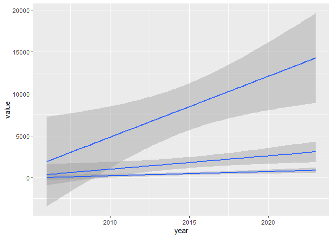

# Class_092523

``` r
library(tidyverse)
Eagle_data <- read.csv("fake_eagle_nest_counts.csv")
glimpse(Eagle_data)
```

    Rows: 18
    Columns: 4
    $ year      <int> 2006, 2007, 2008, 2009, 2010, 2011, 2012, 2013, 2014, 2015, …
    $ pacific   <int> 1636, 2474, 3772, 3179, 5174, 5142, 7880, 11841, 2664, 5930,…
    $ southwest <int> 68, 148, 131, 224, 176, 60, 350, 394, 584, 559, 382, 358, 51…
    $ rocky.mtn <int> 241, 277, 384, 438, 647, 1111, 725, 984, 2492, 1626, 1869, 4…

I think the data is not tidy. The columns represented the year,
locations that the readings were taken that could be collapsed to form
the regions which they are observations for.

``` r
Eagle_data |> 
  pivot_longer(cols = pacific:rocky.mtn,
               names_to = "region", 
               values_to = "value")
```

    # A tibble: 54 × 3
        year region    value
       <int> <chr>     <int>
     1  2006 pacific    1636
     2  2006 southwest    68
     3  2006 rocky.mtn   241
     4  2007 pacific    2474
     5  2007 southwest   148
     6  2007 rocky.mtn   277
     7  2008 pacific    3772
     8  2008 southwest   131
     9  2008 rocky.mtn   384
    10  2009 pacific    3179
    # ℹ 44 more rows

``` r
Eagle_table <- Eagle_data |> 
  pivot_longer(cols = pacific:rocky.mtn,
               names_to = "region", 
               values_to = "value")
Eagle_table |> 
  ggplot(aes(x = year, y = value, group = region)) +
  geom_smooth(method = "lm")
```


