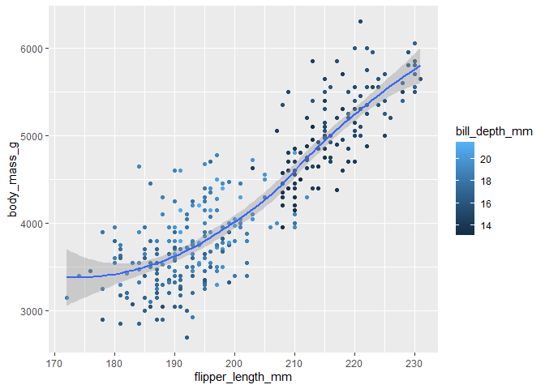

# Homework 03

# Base R and R Basics

HINT: Remember that you can get help on any function by typing
`?`(function name). For instance, `?rnorm` gives help on the `rnorm()`
function.

## Creating and naming variables

1.  Create a variable called `x` and use it to store the result of the
    calculation `(3*(4+2)`.

    ``` r
    x<-3*(4+2)
    ```

2.  Calculate the product of `x` (from the above question) times π.

``` r
x*pi
```

    [1] 56.54867

3.  Use the `getwd()` function to show your current working directory.
    Is that a good working directory, and what program do you think set
    it that way?

    **Answer:**

        [1] "C:/Users/tolajide/OneDrive - University of Tennessee/Documents/MICR-575_2"

    Yes. This directory is what is meant to be.

## Vectors

1.  Use the `c()` function to create a vector of numbers.

``` r
Y<- c(1,2,3,4,5,5,7,8,9,10)
```

2.  Use the `c()` function to create a vector of characters.

``` r
z<- c("one", "two","run,", "cat", "dog", "ate", "eat", "met", "cut", "but")
```

3.  Use the `:` implicit function to create a vector of integers from 1
    to 10.

``` r
y<- c(1:10)
```

4.  Explain *why* the following code returns what it does. Also address
    whether you think this was a good decision on the part of the
    designers of R?

    **Answer:** v1 \<- 1:3 \# This runs to create integers from 1 to 3.
    It works because there are no other command issued that could affect
    the execution of the command

    v2 \<- c(1:4) \# This runs also to create integgers from 1 to 4.

    ``` r
    v1 <- 1:3 # This runs to create integers from 1 to 3. It works because there are no other command issued that could affect the execution of the command

    v2 <- c(1:4) # This runs also to create integers from 1 to 4.
    v1 + v2 # This runs and automatically uses 1 as the fourth integer in the series for V1
    ```

        Warning in v1 + v2: longer object length is not a multiple of shorter object
        length

        [1] 2 4 6 5

    ``` r
    #I do think that this is not a good decision as this allows users not to notice errors in the variables they created as they will think that's the accurate answer to the function.
    ```

``` r
v1 <- 1:3
v2 <- c(1:4)
v1 + v2
```

    [1] 2 4 6 5

5.  Explain what the following code does. It may be helpful to reference
    the answer to the previous question:

    Answer: c(1, 5, 9) + 3 \# This code considers every integer in the
    parentheses as a stand along integer and thus performs the addition
    function on each individual with the integer after the addition
    function outside the parenthesis. This could also result in errors
    as the user might intend to use just a single integer in the set.

``` r
c(1, 5, 9) + 3
```

    [1]  4  8 12

6.  Remove (delete) every variable in your workspace.

``` r
rm(list = ls())
```

## Graphics

1.  Load the tidyverse package. **NOTE:** Be sure to use the chunk
    option `message=FALSE` to suppress the messages that tidyverse
    prints when loaded. These messages are useful in the

``` r
library(tidyverse)
library(palmerpenguins)
```

2.  Recreate the visualization of `body_mass_g` to `flipper_length_mm`,
    from the penguins data set, that is shown in question 8 of section
    2.2.5 of [R4DS](https://r4ds.hadley.nz/data-visualize).

``` r
ggplot(data = na.omit(penguins), mapping = aes(x = flipper_length_mm, y = body_mass_g, )) +

    geom_point(mapping = aes(color = bill_depth_mm)) + geom_smooth(se = TRUE)
```



3.  Explain why each aesthetic is mapped at the level that it is (i.e.,
    at the global level, in the `ggplot()` function call, or at the geom
    level, in the `geom_XXX()` function call). Note: A lot of different
    options will work, but some options are clearly better than others.

Answer: When the Aesthetic is mapped at the global level, all the
variables in the set are considered together while if they were used at
the geom level, it would be specific to a class of the population
dataset. \`\`\`
