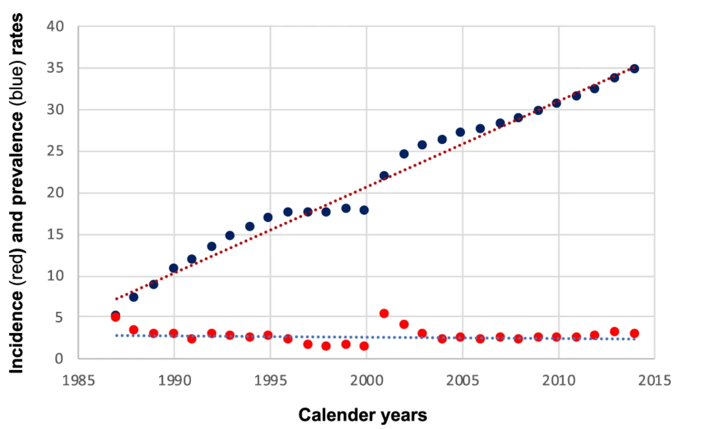
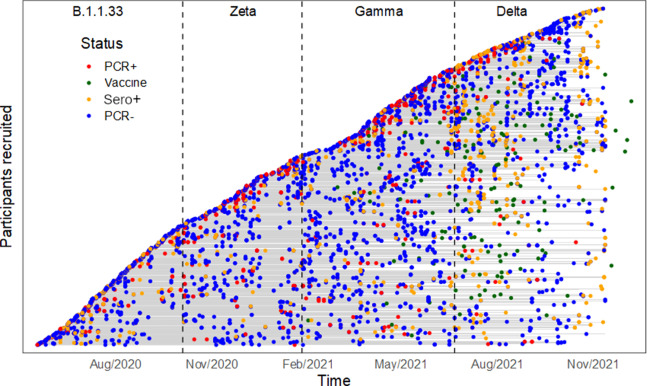

# Homework_6

## Successful Plot

I am of the opinion that this plot is successful because of the
following,

### 1. The axis were labelled well and there was no extraneous labeling or elements on the plot.

### 2. The theme that was used in ploting the two data sets plotted on the chart were appropriately selected to show a clear contrasts between the data set.

### 3. The chart could be easily read and the relationship between the data points could be easily understood.

## Unsuccessful Plot

I am of the opinion that this chart is unsuccessful because of the
following reasons according to Healy,

### 1. The chart is stuffed with too many data points that make the interpretation to the readers very confusing or nearly impossible. The data points overlapped so many times and thus the exact information being communicated will be lost

### 2. The plot made use of not only too many colors but also colors that are difficult to distinguished by people with sight problems and most especially color blind individuals.

### 3. I also think the grey colored lines on the background of the plot is extraneous and confusing.

### 4. I think the plot is not aesthetically pleasing enough because of the aforementioned factors.

### 5. The data presented seems to be misleading as well. The plot suggests that there were no overlap in the prevalence of Covid-19 subspecies at any point in the population.
