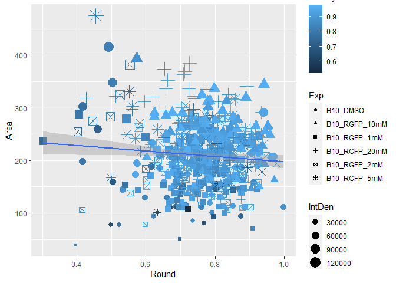

# Homework 7

``` r
library(tidyverse)
B10 <- read_csv("Bottom_10.csv")
ggplot(B10, mapping = aes(x = Round, y = Area )) +
  geom_point(mapping = aes(color = Solidity, shape = Exp, size = IntDen, )) + 
  geom_smooth(method = "lm", se = TRUE)
```



``` r
Badplot <- ggsave("B10.pdf")
```

The plot tries to show the relationship between the roundness of
melanoma cells, the area of the cells, the solidity of the cells, and
the genome acetylation of the cells under six different conditions. This
plot although using a good color pattern, failed to pass the message
across clearly. Many data points overlapped among the different groups,
which was not clearly discernable by looking at the plot.This goes
against the features of a good plot according to Tufte.

The size of the shapes is aimed at indicating the different acetylation
levels in each cell however, some of the shapes look larger than others
even though they are not necessarily larger values. This could distort
the data being presented and could be misleading. The scale for the
solidity dipicted in the color has the highest value as the light shade
of the color. This is against the human perception where darker shades
of colors naturally means higher value. This goes against Tufte’s idea
of a good plot as it could be deceptive.

According to Tufte, good plots are expected to be aesthetically pleasing
while still passing across the information pricisely without distortion.
He opined that chartjunks are extraneous materials that should be done
away with in making plots. This plot comes short on these criteria. The
plot is not nice to look at, there is presence of gridlines which
according to Tufte constitutes chartjunk.

Tufte proposed the idea of using the least ink possible on the plot.This
plot has a lot of ink. Thus making it violate Tufte’s criteria for a
good plot.
