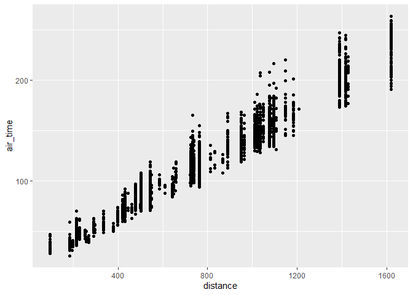
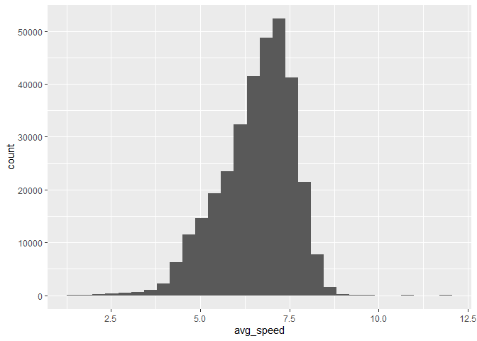

# Hmk_04: Data frames and data wrangling

\#Please read the entire [R for Data
Science](https://r4ds.hadley.nz/data-transform) before you do this
homework.

\#This homework relies on the `nycflights13` package, which contains
several data frames, including `airlines`, `airports`, `flights`,
`planes`, and `weather`. Loading `nycflights13`
(`library(nycflights13)`) puts all of these data frames on the search
path.

## Installing data packages

\#Remember that any package needs to be installed only once (per version
of R), but needs to be loaded every time we start a new R session.

\#To install \#`nyclflights13`, use \#`install.packages("nycflights13")`
(with quotation marks). To load it, use `library(nycflights13)`.

``` r
library(tidyverse)
```

    ── Attaching core tidyverse packages ──────────────────────── tidyverse 2.0.0 ──
    ✔ dplyr     1.1.3     ✔ readr     2.1.4
    ✔ forcats   1.0.0     ✔ stringr   1.5.0
    ✔ ggplot2   3.4.3     ✔ tibble    3.2.1
    ✔ lubridate 1.9.2     ✔ tidyr     1.3.0
    ✔ purrr     1.0.2     
    ── Conflicts ────────────────────────────────────────── tidyverse_conflicts() ──
    ✖ dplyr::filter() masks stats::filter()
    ✖ dplyr::lag()    masks stats::lag()
    ℹ Use the conflicted package (<http://conflicted.r-lib.org/>) to force all conflicts to become errors

``` r
library("nycflights13")
glimpse("nycflights13")
```

     chr "nycflights13"

# Question 1: filtering

\#Make a plot of air time as a function of distance (air time on the y
axis, distance on the x axis) for all flights that meet the following
criteria:

\#- originate from LaGuardia airport (“LGA”)

\#- departed on the 16th of the month

\#- have a flight distance of less than 2000

``` r
hmk4 <- flights |> filter(origin == "LGA", day == 16 & distance <=2000)

ggplot (data = hmk4, mapping = aes(x = distance , y = air_time,)) +
  
  geom_point()
```

    Warning: Removed 75 rows containing missing values (`geom_point()`).



# Question 2: dealing with NAs

\#Make a data frame of all of the rows of `flights` that have values for
*both* `arr_time` and `dep_time` - that is, neither of those values are
`NA`.

## filtering NAs

\#`ggplot()` will automatically remove NA values from the plot, as you
may have seen in question 1, but it emits a warning message about that.
Of course you could silence the warning message using [chunk
options](https://bookdown.org/yihui/rmarkdown-cookbook/chunk-options.html),
but how could you prevent them from appearing in the first place?

``` r
hmw_04 <- flights |> filter (arr_time & distance) |> na.omit()
```

# Question 3: adding columns

\#Create a data frame of average flight speeds, based on `air_time` and
`distance`. Make either a histogram or a density plot of the data. If
you like, you may break the data out (e.g. by airline, or some other
variable) in a way that you think makes sense.

``` r
flights <- flights |> mutate(avg_speed = distance / air_time, .before = 1)
flights |> mutate(speed = distance / air_time)
```

    # A tibble: 336,776 × 21
       avg_speed  year month   day dep_time sched_dep_time dep_delay arr_time
           <dbl> <int> <int> <int>    <int>          <int>     <dbl>    <int>
     1      6.17  2013     1     1      517            515         2      830
     2      6.24  2013     1     1      533            529         4      850
     3      6.81  2013     1     1      542            540         2      923
     4      8.61  2013     1     1      544            545        -1     1004
     5      6.57  2013     1     1      554            600        -6      812
     6      4.79  2013     1     1      554            558        -4      740
     7      6.74  2013     1     1      555            600        -5      913
     8      4.32  2013     1     1      557            600        -3      709
     9      6.74  2013     1     1      557            600        -3      838
    10      5.31  2013     1     1      558            600        -2      753
    # ℹ 336,766 more rows
    # ℹ 13 more variables: sched_arr_time <int>, arr_delay <dbl>, carrier <chr>,
    #   flight <int>, tailnum <chr>, origin <chr>, dest <chr>, air_time <dbl>,
    #   distance <dbl>, hour <dbl>, minute <dbl>, time_hour <dttm>, speed <dbl>

``` r
hist(flights$avg_speed)
```


